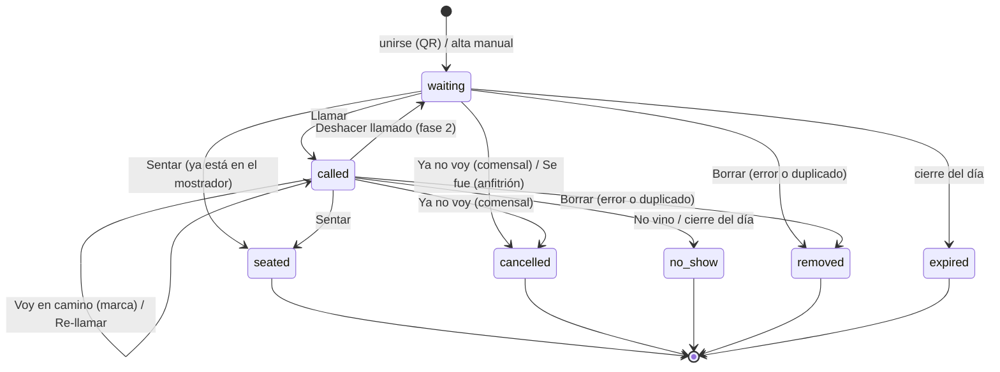

# 04 · Modelo de datos

> Congelado el 16/09/2026. Los deltas de `09_alcance_y_plan_de_implementacion.md` § 3 ya están aplicados aquí:
> `active_key` con fecha de servicio, desempate por `(sort_key, id)`, `client_request_id` también
> en el alta pública e invariante común de los estados terminales.

## 1. Entidades (vista rápida)

    locations 1 ──< host_devices
        │
        1
        └──< tickets 1 ──< ticket_events
                  │
                  1 ──< notifications (fase 2)
    webhook_events (fase 2, idempotencia de Meta)   daily_reports (fase 2, 1 por local y fecha)

En el corte de 4 horas bastan: locations, host_devices, tickets y ticket_events.
DDL completo de referencia (MySQL 8): 04b_modelo_de_datos_mysql.sql

## 2. Tablas y columnas clave
locations
- id, external_ref (id en El Libro), public_code (va en el QR), name, country_code (PE/CL/EC/CO),
  timezone (America/Lima, America/Santiago), day_cutoff_hour (5), minutes_per_party (respaldo del estimador),
  call_grace_minutes (10), max_party_size (20), is_active.

host_devices
- id, location_id, label ("Tablet puerta"), token_hash (sha256), last_seen_at, revoked_at.

tickets (el turno; estado actual)
- id (interno) y public_token (el que va en el link).
- location_id, service_date (día de servicio local).
- source: qr | host.
- customer_name, phone_e164 (NULL si el anfitrión lo agregó sin teléfono), party_size.
- status: waiting | called | seated | cancelled | no_show | removed | expired.
- sort_key (ms de llegada; permite reordenar después). **Nunca se usa solo: el orden y el conteo de
  posición son siempre por (sort_key, id)**, porque dos altas pueden caer en el mismo milisegundo
  (y con reloj congelado en los tests, caen siempre).
- quoted_wait_min y position_at_join: lo que se prometió al unirse (para medir el error del estimador).
- call_count.
- Tiempos en UTC, **escritos siempre por la aplicación**, nunca con DEFAULT CURRENT_TIMESTAMP:
  joined_at, called_at, on_the_way_at, seated_at, closed_at, updated_at. consent_at.
  (DATETIME de MySQL no lleva zona y el DEFAULT sigue la zona de la sesión.)
- active_key: **"{location_id}:{service_date}:{phone}"** mientras el turno está activo; NULL al cerrarse
  y NULL si no hay teléfono. Con índice único garantiza un solo turno activo por teléfono, local **y día
  de servicio**. Sin la fecha, un turno del viernes que quedó abierto bloquea a ese teléfono el sábado.
  Funciona en MySQL y en SQLite porque ambos permiten varios NULL en un índice único (comportamiento
  estándar de SQL, documentado en ambos motores). Evita depender de índices parciales.
- client_request_id: UUID que genera el cliente —**la tablet en el alta manual y el navegador en el alta
  pública**— antes de enviar; único por local → los reintentos devuelven el mismo turno y no duplican.
  Es la clave de idempotencia; `active_key` es la regla de negocio. No son lo mismo (ver § 3.1).

ticket_events (bitácora append-only)
- ticket_id, location_id, type, actor, data (JSON), created_at.
- type: joined, called, recalled, call_undone, on_the_way, seated, left, cancelled, no_show, removed, expired,
  notification_sent, notification_failed, notification_delivered, notification_read.
- actor: customer | host_device:{id} | system | whatsapp.

notifications (fase 2, outbox)
- ticket_id, channel (whatsapp|sms|fake), kind (table_ready), attempt_key único ("{ticket}:{call_count}:{canal}"),
  status (pending|sent|delivered|read|failed), provider_message_id único (para mapear los estados del webhook),
  attempts, last_error.

webhook_events (fase 2): provider + external_id únicos → Meta reintenta; procesar cada evento una sola vez.
daily_reports (fase 2): PK (location_id, service_date) → el cierre se puede reintentar sin duplicar el correo.

## 3. Estados y transiciones

### 3.1 Invariante común (lo más importante del modelo)

> **Toda transición a estado terminal** (seated, cancelled, no_show, removed, expired) fija en el
> **mismo UPDATE**: `status`, `closed_at = now`, `active_key = NULL`.
> El `ticket_event` se inserta en la **misma transacción**. Si el evento falla, la transición no ocurre.

Sin esta regla escrita en un solo lugar, cada acción la implementa "casi igual" y algún cierre deja la
clave activa ocupada: ese teléfono no puede volver a la cola y nadie entiende por qué. El test que la
cubre (parametrizado sobre los cuatro estados) es el más valioso del repo.

**Idempotencia ≠ deduplicación**, y conviene no mezclarlas:
- *Idempotencia* = `client_request_id`. Misma solicitud reenviada → mismo resultado, incluso si el turno
  ya terminó. Protege contra la señal mala.
- *Deduplicación* = `active_key`. Regla de negocio: un turno activo por teléfono, local y día.
  **No autentica a nadie**: conocer un teléfono no da derecho a ese turno, así que una solicitud distinta
  con el mismo teléfono recibe 409 y **nunca el token** del turno existente.

(Imagen del diagrama: 04c_diagrama_estados.png — generada antes de congelar la matriz; le falta la
flecha `called → removed`. La fuente válida es el Mermaid de abajo y la matriz de `09_alcance_y_plan_de_implementacion.md` § 4.)

| Desde | Acción | Hacia | Actor | Efectos |
|---|---|---|---|---|
| (nuevo) | unirse / alta manual | waiting | comensal / anfitrión | evento joined; guarda quoted_wait_min y position_at_join |
| waiting | Llamar | called | anfitrión | called_at, call_count+1, aviso, evento |
| waiting | Sentar | seated | anfitrión | seated_at (si ya está en el mostrador no se gasta un WhatsApp) |
| waiting | Ya no voy | cancelled | comensal (web o WhatsApp) | invariante § 3.1 |
| waiting | Se fue | cancelled | anfitrión | igual, actor distinto. **Solo desde waiting** (ver nota) |
| waiting | Borrar | removed | anfitrión | no cuenta en el reporte |
| waiting | cierre del día | expired | sistema | cuenta como "se fue sin sentarse" — fase 2 |
| called | Voy en camino | called | comensal | on_the_way_at **solo si es NULL**; evento solo la 1.ª vez; siempre 200 |
| called | Re-llamar | called | anfitrión | call_count+1, nuevo aviso (con límite) — fase 2 |
| called | Deshacer llamado | waiting | anfitrión | solo por error y en ventana corta; el mensaje ya salió — fase 2 |
| called | Sentar | seated | anfitrión | seated_at + invariante |
| called | No vino | no_show | anfitrión | invariante |
| called | Ya no voy | cancelled | comensal | cuenta como "no vino al ser llamado" |
| called | Borrar | removed | anfitrión | el duplicado también puede haber sido llamado |
| called | cierre del día | no_show | sistema | fase 2 |
| cualquier final | cualquier acción | — | — | 409 (o 200 sin efectos si ya está en el destino) |

Nota sobre «Se fue»: **solo existe desde `waiting`**. Si alguien ya fue llamado y avisa en persona que
se va, la acción correcta es «No vino», que es lo que el reporte cuenta como "no vino al ser llamado".
Tener «Se fue» disponible en una fila llamada crea dos caminos al mismo hecho y el reporte deja de ser
interpretable. En la tablet, cada fila muestra solo los botones válidos para su estado.

Implementación (el corazón del modelo):
    UPDATE tickets
       SET status = 'called', called_at = :now, call_count = call_count + 1
     WHERE id = :id AND location_id = :loc AND status = 'waiting'
    → rowcount 1: yo gané, envío el aviso.
    → rowcount 0: releo. ¿Ya está 'called'? respondo 200 sin enviar nada. ¿Otro estado? 409.
Dos anfitriones tocan "Llamar" al mismo tiempo: la base serializa los dos UPDATE; solo uno encuentra
status = 'waiting'. Un solo WhatsApp. (Verificado: el segundo UPDATE devuelve rowcount 0.)

El caso más interesante no es ese, sino **"Llamar" y "Sentar" a la vez** sobre la
misma fila: ambos filtran por status='waiting', uno gana, el otro relee y encuentra un estado que no
es su destino → 409 → la tablet refresca y muestra "Otro anfitrión ya lo atendió". Sin el 409, el
segundo anfitrión creería que su acción se aplicó.

Límite honesto de esta garantía: el UPDATE condicional asegura **una sola transición**, no **un solo
envío**. Si el proceso muere entre el commit y el envío del aviso, el turno queda llamado sin aviso
(la tablet lo muestra y el anfitrión llama por voz). La entrega con reintentos idempotentes es la
tabla `notifications` de fase 2, y aun así es "al menos una vez", no "exactamente una".

## 4. Posición, tiempo estimado y "espera media"
- **Grupos delante** = cantidad de turnos waiting del mismo local **y misma service_date** con
  **(sort_key, id) menor**. Los llamados ya no están "delante"; en la tablet el orden sí los incluye.
  El texto público congelado es "Hay N grupos antes que ti", no "Estás en el puesto N": con llamados
  fuera de orden (H1), "puesto" promete una secuencia de atención que el local no cumple.
- Tiempo estimado v1 = max(5, redondear hacia arriba a múltiplo de 5 ((grupos_delante + 1) × minutes_per_party)).
  minutes_per_party inicial: 4 (el prototipo implica ~3,5). Mejor sobreestimar que subestimar: la satisfacción cae
  cuando la espera supera lo prometido.
  **Es una heurística sin calibrar, y hay que decirlo así**: si no se libera ninguna mesa, prometerle
  5 minutos al primero falla por mucho. En pantalla va como "≈ 28 min" con "es aproximado: depende de
  las mesas que se vayan liberando", y se guarda quoted_wait_min para medir el error desde el día 1.
- Fase 2 (con datos): minutes_per_party = 60 / grupos sentados en la última hora, acotado entre 2 y 15; si hubo menos
  de 3 sentados, usar el valor del local. Considerar grupos grandes (5+) aparte.
- Calibración: comparar quoted_wait_min con (seated_at − joined_at) por local y franja horaria.
- "Espera media" (encabezado de la tablet y reporte) = promedio de (seated_at − joined_at) de los sentados del día.
- "Esperando" por fila = ahora − joined_at, calculado en el servidor (no depender del reloj de la tablet).
- "Tolerancia vencida" = status called y ahora > called_at + call_grace_minutes → la fila se pinta en rojo.

## 5. Fecha de servicio (service_date)
- service_date = fecha local de (joined_at en la zona del local − 5 horas).
- Ejemplos verificados:
  - Sábado 19/09 00:30 en Lima → servicio del viernes 18/09.
  - El mismo instante (sábado 08:30 UTC) es 03:30 en Lima → viernes 18/09, y 05:30 en Santiago → sábado 19/09.
- Se guarda como columna para indexar reportes; como los tiempos están en UTC, se puede recalcular.

## 6. Reporte del día (definiciones propuestas)
- Se unieron = turnos del día excepto removed. (Es "altas válidas", no "todos los registros creados".)
- Se sentaron = seated.
- Se fueron sin sentarse = cancelled sin llamado (incluye "Se fue" marcado por el anfitrión) **+ expired**.
- No vinieron al ser llamados = no_show + cancelled después de ser llamados.
- Espera media = promedio de (seated_at − joined_at) de los sentados. NULL si no hubo ninguno:
  "sin datos" y "0 minutos" no son lo mismo y no deben mostrarse igual.
- Invariante después del cierre: se unieron = se sentaron + se fueron sin sentarse + no vinieron. (Test.)

Tres límites que hay que decir antes de que los pregunten:
1. **La igualdad contable puede cumplirse y el número ser falso.** `expired` y el `no_show` del cierre no
   son hechos observados: son "nadie lo resolvió". Si el anfitrión sienta a alguien y olvida marcarlo,
   el cierre lo cuenta como abandono. Por eso el reporte separa **desenlaces confirmados** (los que marcó
   una persona) de **cierre administrativo** (`expired` y los `called` sin resolver), en vez de fundirlos.
   Un local con mucho cierre administrativo tiene un problema de uso de la tablet, no de comensales.
2. **El encargo habla de gente; el modelo cuenta grupos.** "Se fueron sin sentarse 31" son 31 grupos.
   Para contar personas hay que sumar `party_size`. Decidir cuál se reporta —y ponerlo en el encabezado—
   antes de la primera semana: cambiar la definición a mitad del piloto invalida la comparación.
3. **La espera media solo mide a los que se quedaron.** Es el sesgo de supervivencia clásico: quienes
   abandonaron esperaron distinto y no entran en el promedio.

SQL de referencia (MySQL; requiere que el día esté cerrado):

    SELECT
      COUNT(*)                                                                    AS se_unieron,
      SUM(status = 'seated')                                                      AS se_sentaron,
      SUM(status = 'expired' OR (status = 'cancelled' AND called_at IS NULL))     AS se_fueron_sin_sentarse,
      SUM(status = 'no_show' OR (status = 'cancelled' AND called_at IS NOT NULL)) AS no_vinieron_al_ser_llamados,
      ROUND(AVG(CASE WHEN status = 'seated'
                     THEN TIMESTAMPDIFF(SECOND, joined_at, seated_at) END) / 60)  AS espera_media_min
    FROM tickets
    WHERE location_id = ? AND service_date = ? AND status <> 'removed';

Portabilidad: TIMESTAMPDIFF no existe en SQLite. En el código, trae las filas del día (unas 200 como mucho por local)
y calcula en Python; así el mismo código corre en SQLite y MySQL.

## 7. Qué NO modelar en v1 (y por qué)
- customers / "frecuente": el origen del dato está indefinido (pregunta al diseñador) y es dato personal con retención.
- tables / asignación de mesas: vive en El Libro; "Sentar" solo cierra el turno.
- users / roles: no hay login personal.
- reservations: fuera del piloto (solo walk-ins).
- Historial de posiciones: se reconstruye con los eventos si hace falta.
- zone / ambiente en `tickets`: no se escribe. Una sola cola por local en esta versión (07 § 3.1 P2);
  si el diseñador pide zonas, es un campo aquí y la lista de zonas en `locations`, no tablas nuevas.
- displayed_ahead: tampoco se escribe. El número visible nunca sube, pero hoy eso sale gratis porque
  `groups_ahead` no puede crecer sin reordenar; la columna entra el día que entre reordenar (07 § 3.1 P1).

## 8. Índices que importan
- tickets (location_id, service_date, status, sort_key) → **la cola**, la consulta más frecuente (cada
  5–15 s). Lleva service_date porque la cola filtra siempre por día de servicio: sin ese filtro, los
  pendientes que quedaron abiertos ayer siguen apareciendo hoy.
- tickets (location_id, service_date, status) → reporte y cierre.
- tickets public_token único → pantalla del comensal. En MySQL, con colación binaria: es una credencial
  opaca, y la colación por defecto compara sin distinguir mayúsculas.
- tickets active_key único → un turno activo por teléfono, local y día de servicio, **y la consulta exacta
  de «Ya estoy en la lista de espera»**: `/lookup` arma `"{location_id}:{service_date}:{phone_e164}"` y
  busca por igualdad en este mismo índice. No hace falta índice ni columna nueva (09 § 2.5).
- tickets (location_id, client_request_id) único → idempotencia del alta.
- ticket_events (ticket_id, created_at) y (location_id, created_at).

Nota: `ticket_events.location_id` se guarda por comodidad de consulta, pero la FK simple no garantiza que
coincida con el del ticket. Se deriva **siempre** del ticket en un solo punto del código; una FK compuesta
para cubrir eso no vale la complejidad con cuatro tablas. Riesgo aceptado a conciencia.
